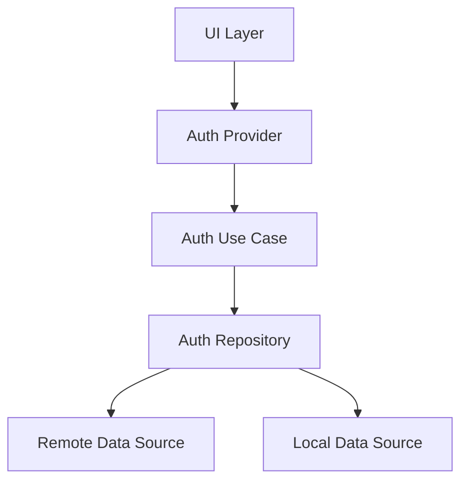
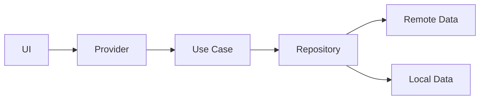

# System Patterns

## Architecture Overview
The application follows Clean Architecture principles with three main layers:
1. Presentation Layer (UI)
2. Domain Layer (Business Logic)
3. Data Layer (Data Sources)

## Design Patterns

### State Management
- **Riverpod Pattern**
  - Use `@riverpod` annotation for providers
  - Implement `AsyncNotifierProvider` for async state
  - Use `NotifierProvider` for synchronous state
  - Avoid `StateProvider` for complex state

### Repository Pattern
```dart
abstract class Repository {
  Future<Result> getData();
  Future<Result> updateData();
  Future<Result> deleteData();
}

class RepositoryImpl implements Repository {
  final RemoteDataSource remote;
  final LocalDataSource local;
  
  // Implementation
}
```

### Use Case Pattern
```dart
abstract class UseCase<Type, Params> {
  Future<Result<Type>> call(Params params);
}

class GetDataUseCase implements UseCase<Data, NoParams> {
  final Repository repository;
  
  // Implementation
}
```

### Dependency Injection
- Use Riverpod for dependency injection
- Implement providers for services and repositories
- Use `@riverpod` annotation for automatic code generation

## Component Relationships

### Authentication Flow


### Data Flow


## Key Technical Decisions

### State Management
- Chose Riverpod over other solutions for:
  - Better testability
  - Automatic code generation
  - Type safety
  - Dependency injection

### Navigation
- Implemented GoRouter for:
  - Deep linking support
  - Nested navigation
  - Type-safe routes
  - Easy route management

### Local Storage
- Selected Hive for:
  - Fast performance
  - Type safety
  - Easy to use
  - Good documentation

### Network Layer
- Implemented Dio with:
  - Interceptors for logging
  - Retry mechanism
  - Error handling
  - CSRF protection

## Error Handling Strategy
1. Use `Result` type for error handling
2. Implement custom exceptions
3. Centralized error handling in repositories
4. UI-level error display using `SelectableText.rich`

## Testing Strategy
1. Unit Tests
   - Test use cases
   - Test repositories
   - Test providers

2. Widget Tests
   - Test UI components
   - Test navigation
   - Test state changes

3. Integration Tests
   - Test complete features
   - Test API integration
   - Test local storage

## Performance Optimization
1. Use `const` constructors
2. Implement proper list view optimization
3. Use `cached_network_image` for images
4. Implement proper error handling
5. Use proper state management patterns 